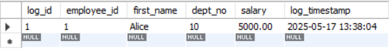
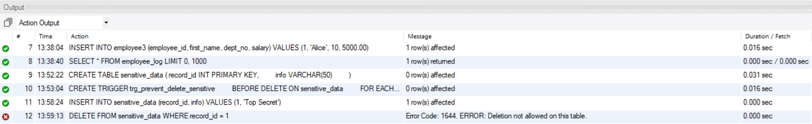
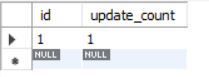
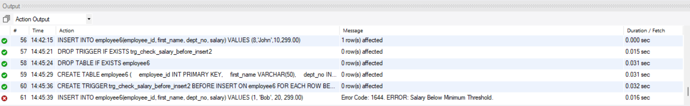
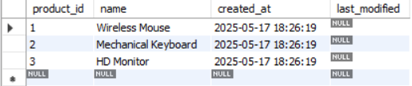

# Experiment 10: PL/SQL – Triggers

## AIM
To write and execute PL/SQL trigger programs for automating actions in response to specific table events like INSERT, UPDATE, or DELETE.

---

## THEORY

A **trigger** is a stored PL/SQL block that is automatically executed or fired when a specified event occurs on a table or view. Triggers can be used for enforcing business rules, auditing changes, or automatic updates.

### Types of Triggers:
- **Before Trigger**: Executes before the operation (INSERT, UPDATE, DELETE).
- **After Trigger**: Executes after the operation.
- **Row-level Trigger**: Executes for each affected row.
- **Statement-level Trigger**: Executes once for the triggering statement.

**Basic Syntax:**
```sql
CREATE OR REPLACE TRIGGER trigger_name
BEFORE|AFTER INSERT|UPDATE|DELETE ON table_name
[FOR EACH ROW]
BEGIN
   -- trigger logic
END;
```

## 1. Write a trigger to log every insertion into a table.
**Steps:**
- Create two tables: `employees` (for storing data) and `employee_log` (for logging the inserts).
- Write an **AFTER INSERT** trigger on the `employees` table to log the new data into the `employee_log` table.

#### Query:
``` SQL
CREATE TABLE employee3 
(
	employee_id INT PRIMARY KEY,
    first_name VARCHAR(50),
    dept_no INT,
    salary DECIMAL(10,2)
);
    
CREATE TABLE employee_log 
(
		log_id INT AUTO_INCREMENT PRIMARY KEY,
        employee_id INT,
        first_name VARCHAR(50),
        dept_no INT,
        salary DECIMAL(10,2),
        log_timestamp TIMESTAMP DEFAULT current_timestamp
);
    
DELIMITER $$
    CREATE TRIGGER trg_log_employee_insert
    AFTER INSERT ON employee3
    FOR EACH ROW
    BEGIN
		INSERT INTO employee_log (employee_id, first_name, dept_no, salary) VALUES (NEW.employee_id, NEW.first_name, NEW.dept_no, NEW.salary);
	END$$
    
DELIMITER ;

INSERT INTO employee3 (employee_id, first_name, dept_no, salary) VALUES (1, 'Alice', 10, 5000.00);
    
SELECT * FROM employee_log;
```

### Expected Output:
- A new entry is added to the `employee_log` table each time a new record is inserted into the `employees` table.

### Output Got:

---

## 2. Write a trigger to prevent deletion of records from a sensitive table.
**Steps:**
- Write a **BEFORE DELETE** trigger on the `sensitive_data` table.
- Use `RAISE_APPLICATION_ERROR` to prevent deletion and issue a custom error message.

#### Query:
``` SQL
CREATE TABLE sensitive_data 
(
		record_id INT PRIMARY KEY,
        info VARCHAR(50)
);
        
DELIMITER $$
        CREATE TRIGGER trg_prevent_delete_sensitive
        BEFORE DELETE ON sensitive_data
        FOR EACH ROW
        BEGIN 
			SIGNAL SQLSTATE '45000'
            SET MESSAGE_TEXT = 'ERROR: Deletion not allowed on this table.';
		END$$
DELIMITER ;
        
INSERT INTO sensitive_data (record_id, info) VALUES (1, 'Top Secret');
DELETE FROM sensitive_data WHERE record_id = 1;
```

### Expected Output:
- If an attempt is made to delete a record from `sensitive_data`, an error message is raised, e.g., `ERROR: Deletion not allowed on this table.`

### Output Got:


---

## 3. Write a trigger to automatically update a `last_modified` timestamp.
**Steps:**
- Add a `last_modified` column to the `products` table.
- Write a **BEFORE UPDATE** trigger on the `products` table to set the `last_modified` column to the current timestamp whenever an update occurs.

#### Query:
``` SQL
CREATE TABLE products 
(
    product_id SERIAL PRIMARY KEY,
    name VARCHAR(100) NOT NULL,
    description TEXT,
    price NUMERIC(10, 2),
    stock_quantity INT,
    created_at TIMESTAMP DEFAULT CURRENT_TIMESTAMP,
    last_modified TIMESTAMP
);
DELIMITER $$

    CREATE TRIGGER trg_set_last_modified
    BEFORE UPDATE ON products
    FOR EACH ROW
    BEGIN
        SET NEW.last_modified = CURRENT_TIMESTAMP;
    END$$

DELIMITER ;

INSERT INTO products (name, description, price, stock_quantity)
VALUES 
('Wireless Mouse', 'Ergonomic wireless mouse with USB receiver', 25.99, 100),
('Mechanical Keyboard', 'RGB backlit mechanical keyboard', 59.99, 50),
('HD Monitor', '24-inch Full HD LED monitor', 149.99, 30);

UPDATE products SET price = 27.99 WHERE product_id = 1;
UPDATE products SET name = 'Key Board '  WHERE product_id = 2;
UPDATE products SET stock_quantity = 40 WHERE product_id = 3;

SELECT product_id, name, created_at, last_modified FROM products;

```

### Expected Output:
- The `last_modified` column in the `products` table is updated automatically to the current date and time when any record is updated.

### Output Got:
* __Before Updating the record__


* __After Updating the record__


---

## 4. Write a trigger to keep track of the number of updates made to a table.
**Steps:**
- Create an `audit_log` table with a counter column.
- Write an **AFTER UPDATE** trigger on the `customer_orders` table to increment the counter in the `audit_log` table every time a record is updated.

#### Query:
``` SQL
CREATE TABLE customer_orders 
(
		order_id INT PRIMARY KEY,
        customer_name VARCHAR(100),
        order_amount DECIMAL(10,2)
);
    
CREATE TABLE audit_log 
(
		id INT PRIMARY KEY,
        update_count INT DEFAULT 0
);
    
INSERT INTO audit_log (id,update_count) VALUES (1,0);
    
DELIMITER $$
        CREATE TRIGGER trg_track_updates
        AFTER UPDATE ON customer_orders
        FOR EACH ROW
        BEGIN
            UPDATE audit_log
            SET update_count = update_count +1
            WHERE id=1;
        END$$
DELIMITER ;
    
INSERT INTO customer_orders (order_id, customer_name, order_amount) VALUES (101,'Alice',150.00);
    
UPDATE customer_orders SET order_amount = 200.00 WHERE order_id = 101;
    
UPDATE customer_orders SET order_amount = 400.00 WHERE order_id = 101;
    
SELECT * FROM audit_log;
```

### Expected Output:
- The `audit_log` table will maintain a count of how many updates have been made to the `customer_orders` table.

### Output Got:
* __First Update__



* __Second Update__


---

## 5. Write a trigger that checks a condition before allowing insertion into a table.
**Steps:**
- Write a **BEFORE INSERT** trigger on the `employees` table to check if the inserted salary meets a specific condition (e.g., salary must be greater than 3000).
- If the condition is not met, raise an error to prevent the insert.

#### Query:
``` SQL
CREATE TABLE employee6 
(
    employee_id INT PRIMARY KEY,
    first_name VARCHAR(50),
    dept_no INT,
    salary DECIMAL(10,2)
);

DELIMITER $$

        CREATE TRIGGER trg_check_salary_before_insert2
        BEFORE INSERT ON employee6
        FOR EACH ROW
        BEGIN
            IF NEW.salary < 3000 THEN
                SIGNAL SQLSTATE '45000'
                SET MESSAGE_TEXT = 'ERROR: Salary Below Minimum Threshold.';
            END IF;
        END$$

DELIMITER ;

INSERT INTO employee6(employee_id, first_name, dept_no, salary) VALUES (1, 'Bob', 20, 299.00);
```

### Expected Output:
- If the inserted salary in the `employees` table is below the condition (e.g., salary < 3000), the insert operation is blocked, and an error message is raised, such as: `ERROR: Salary below minimum threshold.`

### Output Got:

## RESULT
Thus, the PL/SQL trigger programs were written and executed successfully.

