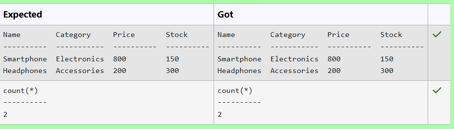
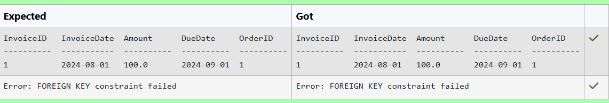
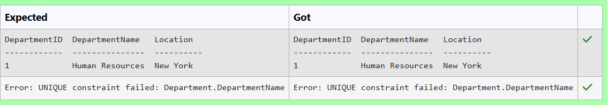
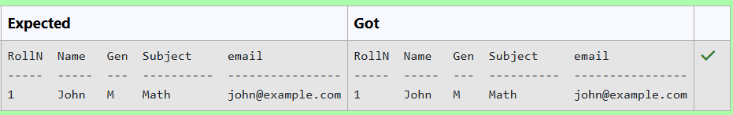
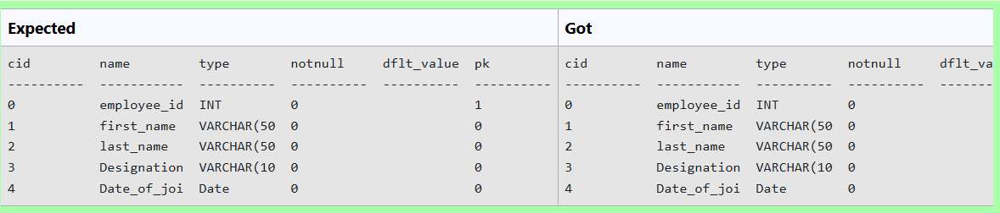
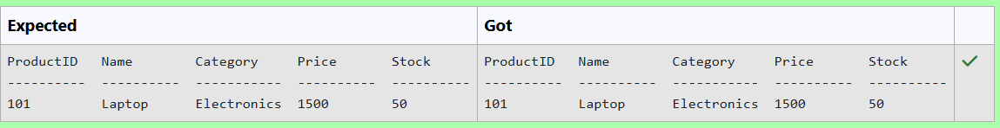
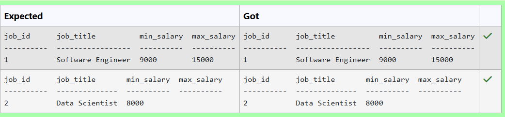
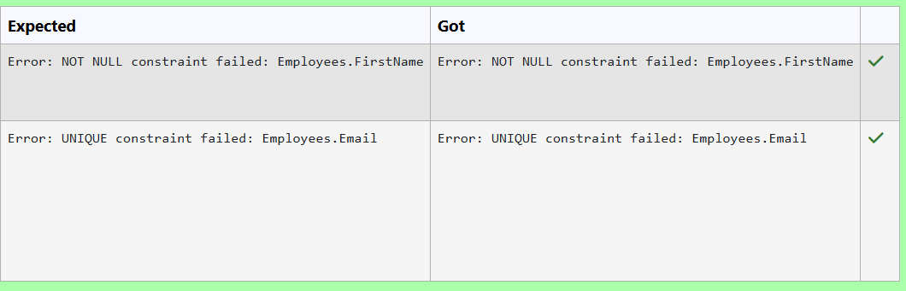
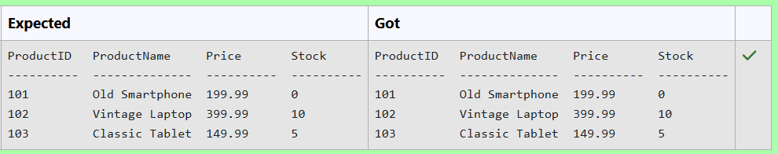

# Experiment 2: DDL Commands

## AIM
To study and implement DDL commands and different types of constraints.

## THEORY

### 1. CREATE
Used to create a new relation (table).

**Syntax:**
```sql
CREATE TABLE (
  field_1 data_type(size),
  field_2 data_type(size),
  ...
);
```
### 2. ALTER
Used to add, modify, drop, or rename fields in an existing relation.
(a) ADD
```sql
ALTER TABLE std ADD (Address CHAR(10));
```
(b) MODIFY
```sql
ALTER TABLE relation_name MODIFY (field_1 new_data_type(size));
```
(c) DROP
```sql
ALTER TABLE relation_name DROP COLUMN field_name;
```
(d) RENAME
```sql
ALTER TABLE relation_name RENAME COLUMN old_field_name TO new_field_name;
```
### 3. DROP TABLE
Used to permanently delete the structure and data of a table.
```sql
DROP TABLE relation_name;
```
### 4. RENAME
Used to rename an existing database object.
```sql
RENAME TABLE old_relation_name TO new_relation_name;
```
### CONSTRAINTS
Constraints are used to specify rules for the data in a table. If there is any violation between the constraint and the data action, the action is aborted by the constraint. It can be specified when the table is created (using CREATE TABLE) or after it is created (using ALTER TABLE).
### 1. NOT NULL
When a column is defined as NOT NULL, it becomes mandatory to enter a value in that column.
Syntax:
```sql
CREATE TABLE Table_Name (
  column_name data_type(size) NOT NULL
);
```
### 2. UNIQUE
Ensures that values in a column are unique.
Syntax:
```sql
CREATE TABLE Table_Name (
  column_name data_type(size) UNIQUE
);
```
### 3. CHECK
Specifies a condition that each row must satisfy.
Syntax:
```sql
CREATE TABLE Table_Name (
  column_name data_type(size) CHECK (logical_expression)
);
```
### 4. PRIMARY KEY
Used to uniquely identify each record in a table.
Properties:
Must contain unique values.
Cannot be null.
Should contain minimal fields.
Syntax:
```sql
CREATE TABLE Table_Name (
  column_name data_type(size) PRIMARY KEY
);
```
### 5. FOREIGN KEY
Used to reference the primary key of another table.
Syntax:
```sql
CREATE TABLE Table_Name (
  column_name data_type(size),
  FOREIGN KEY (column_name) REFERENCES other_table(column)
);
```
### 6. DEFAULT
Used to insert a default value into a column if no value is specified.

Syntax:
```sql
CREATE TABLE Table_Name (
  col_name1 data_type,
  col_name2 data_type,
  col_name3 data_type DEFAULT 'default_value'
);
```

**Question 1**
---
<pre> Insert the following products into the Products table: 

    Name      Category  Price  Stock 
----------- ----------- ------ ------ 
Smartphone  Electronics   800     150 
Headphones  Accessories   200     300 </pre>
#### Query:
```sql
INSERT INTO Products (Name, Category, Price, Stock) VALUES ('Smartphone','Electronics',800,150);

INSERT INTO Products (Name, Category, Price, Stock) VALUES ('Headphones','Accessories',200,300);
```

**Output:**



**Question 2**
---
Create a table named Invoices with the following constraints:
 * InvoiceID as INTEGER should be the primary key.
* InvoiceDate as DATE.
* Amount as REAL should be greater than 0.
* DueDate as DATE should be greater than the InvoiceDate.
* OrderID as INTEGER should be a foreign key referencing Orders(OrderID)

#### Query: 
```sql
CREATE TABLE Invoices (
    InvoiceID int primary key,
    InvoiceDate Date,
    Amount real check (Amount >0),
    DueDate Date CHECK (DueDate>InvoiceDate),
    OrderID int,
    FOREIGN KEY (OrderID) REFERENCES Orders(OrderID)
);
```

**Output:**



**Question 3**
---
Create a table named Department with the following constraints:

* DepartmentID as INTEGER should be the primary key.
* DepartmentName as TEXT should be unique and not NULL.
* Location as TEXT.
#### Query:
```sql
CREATE TABLE Department (
    DepartmentID int primary key,
    DepartmentName text unique NOT NULL,
    Location text
);
```

**Output:**



**Question 4**
---
Write an SQL query to add a new column email of type TEXT to the Student_details table, and ensure that this column cannot contain NULL values and make default value as 'Invalid'
#### Query
```sql
ALTER TABLE Student_details ADD COLUMN email TEXT NOT NULL DEFAULT 'Invalid';
```

**Output:**



**Question 5**
---
Write a SQL Query  to add attribute Date_of_joining as Date and rename the attribute job_title as Designation in the table 'Employees'


#### Query
```sql
ALTER TABLE Employees ADD COLUMN Date_of_joining Date;

ALTER TABLE Employees RENAME COLUMN Job_title TO Designation;
```

**Output:**



**Question 6**
---
Create a table named Reviews with the following columns:

 * ReviewID as INTEGER
* ProductID as INTEGER
* Rating as REAL
* ReviewText as TEXT
#### Query
```sql
CREATE TABLE Reviews(
    ReviewID INTEGER,
    ProductID INTEGER,
    Rating REAL,
    ReviewText TEXT
);
```

**Output:**


**Question 7**
---
Insert a new product with ProductID 101, Name Laptop, Category Electronics, Price 1500, and Stock 50 into the Products table.

#### Query
```sql
INSERT INTO Products (ProductID,Name,Category,Price,Stock) VALUES (101,'Laptop','Electronics',1500,50);
```

**Output:**



**Question 8**
---
Create a table named jobs including columns job_id, job_title, min_salary and max_salary, and make sure that, the default value for job_title is blank and min_salary is 8000 and max_salary is NULL will be entered automatically at the time of insertion if no value assigned for the specified columns.
#### Query
```sql
CREATE TABLE jobs (
    job_id INT PRIMARY KEY,
    job_title VARCHAR(225) DEFAULT '',
    min_salary INT DEFAULT 8000,
    max_salary INT DEFAULT NULL
);
```

**Output:**



**Question 9**
---
Create a table named Employees with the following constraints:

* EmployeeID should be the primary key.
* FirstName and LastName should be NOT NULL.
* Email should be unique.
* Salary should be greater than 0.
* DepartmentID should be a foreign key referencing the          Departments table.
#### Query 
```sql
CREATE TABLE Employees (
    EmployeeID INTEGER PRIMARY KEY,
    FirstName NOT NULL,
    LastName NOT NULL,
    Email char(25) UNIQUE,
    Salary INTEGER CHECK(Salary>0),
    DepartmentID INTEGER,
    FOREIGN KEY(DepartmentID) REFERENCES Departments
);
```

**Output:**


**Question 10**
---
Insert all products from Discontinued_products into Products.

Table attributes are ProductID, ProductName, Price, Stock
#### Query
```sql
INSERT INTO Products (ProductID,ProductName,Price,Stock) SELECT ProductID,ProductName,Price,Stock FROM Discontinued_products;
```

**Output:**




## RESULT
Thus, the SQL queries to implement different types of constraints and DDL commands have been executed successfully.
