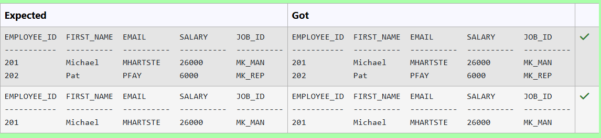
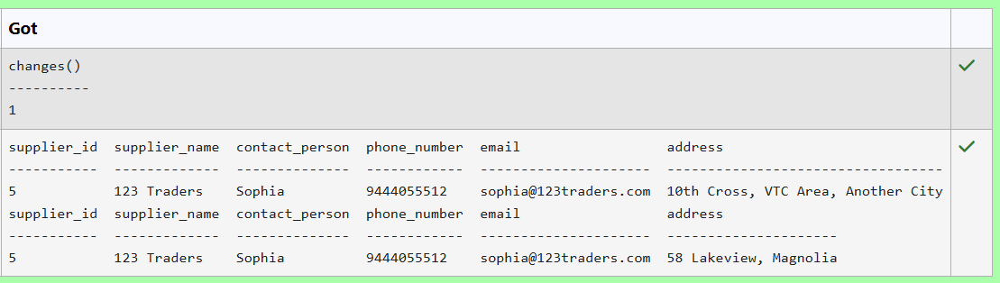
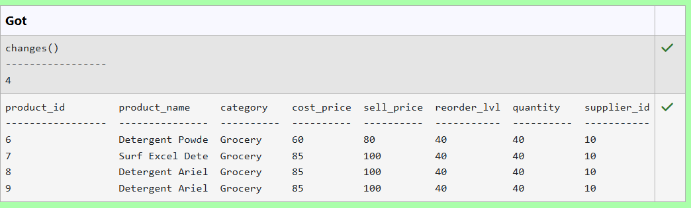
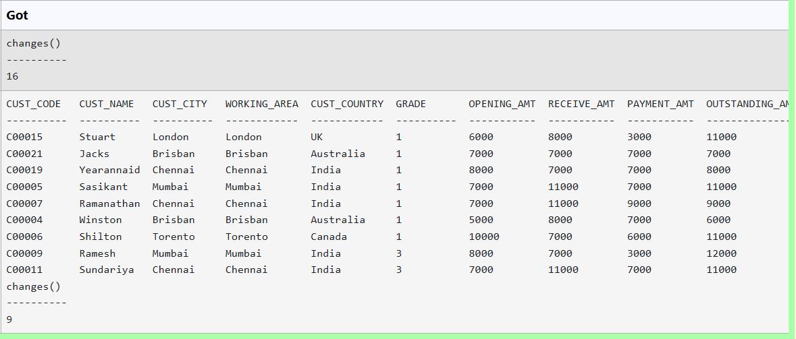
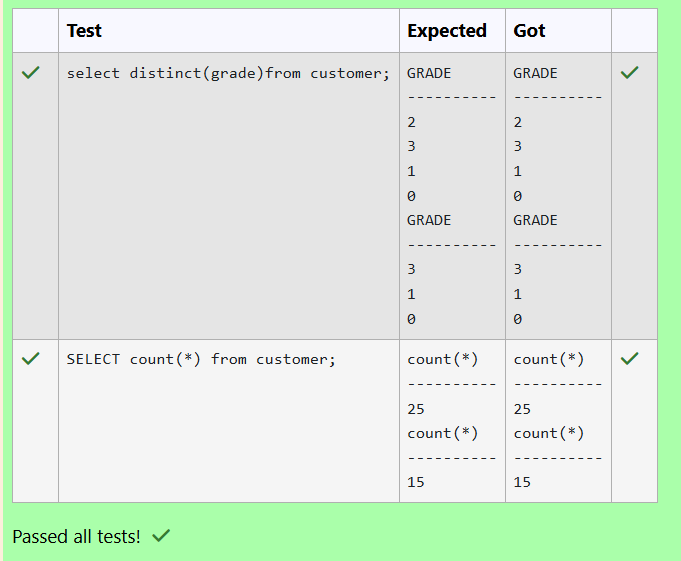
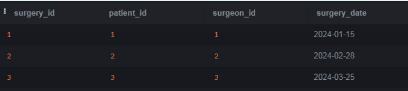
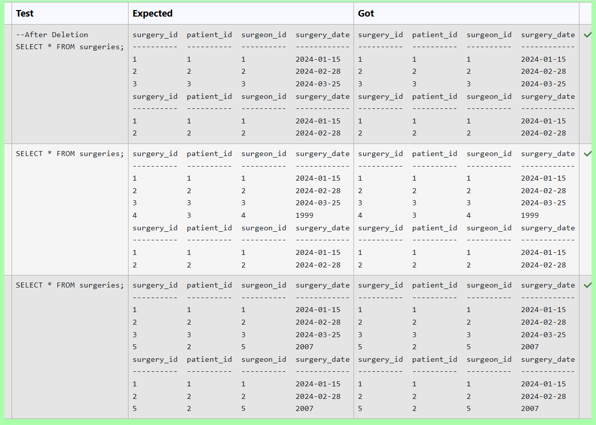
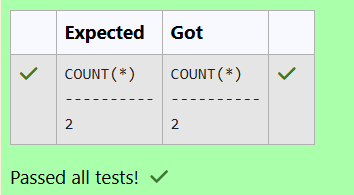
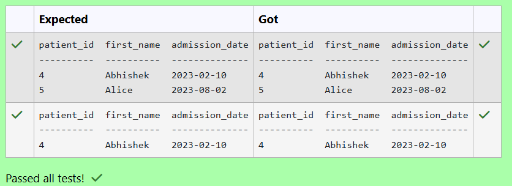
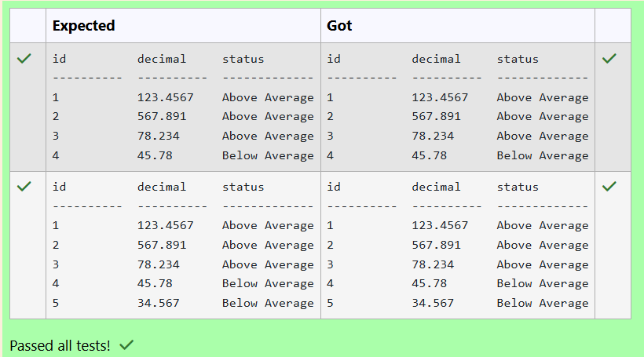

# Experiment 3: DML Commands

## AIM
To study and implement DML (Data Manipulation Language) commands.

## THEORY

### 1. INSERT INTO
Used to add records into a relation.
These are three type of INSERT INTO queries which are as
A)Inserting a single record
**Syntax (Single Row):**
```sql
INSERT INTO table_name (field_1, field_2, ...) VALUES (value_1, value_2, ...);
```
**Syntax (Multiple Rows):**
```sql
INSERT INTO table_name (field_1, field_2, ...) VALUES
(value_1, value_2, ...),
(value_3, value_4, ...);
```
**Syntax (Insert from another table):**
```sql
INSERT INTO table_name SELECT * FROM other_table WHERE condition;
```
### 2. UPDATE
Used to modify records in a relation.
Syntax:
```sql
UPDATE table_name SET column1 = value1, column2 = value2 WHERE condition;
```
### 3. DELETE
Used to delete records from a relation.
**Syntax (All rows):**
```sql
DELETE FROM table_name;
```
**Syntax (Specific condition):**
```sql
DELETE FROM table_name WHERE condition;
```
### 4. SELECT
Used to retrieve records from a table.
**Syntax:**
```sql
SELECT column1, column2 FROM table_name WHERE condition;
```
**Question 1**
--

Write a SQL statement to Double the salary for employees in department 20 who have a job_id ending with 'MAN'

__Employees table__
<pre>
employee_id
first_name
last_name
email
phone_number
hire_date
job_id
salary
commission_pct
manager_id
department_id
</pre>
#### Query
```sql
UPDATE employees SET salary = salary*2 WHERE department_id = 20 AND job_id LIKE '%MAN';
```

**Output:**



**Question 2**
---

Write a SQL statement to Update the address to '58 Lakeview, Magnolia' where supplier ID is 5 in the suppliers table.

__Suppliers Table__ 
<pre>
name               type
-----------------  ---------------
supplier_id        INT
supplier_name      VARCHAR(100)
contact_person     VARCHAR(100)
phone_number       VARCHAR(20)
email              VARCHAR(100)
address            VARCHAR(250)
</pre>
#### Query
```sql
UPDATE suppliers SET address = '58 Lakeview, Magnolia'  WHERE supplier_id = 5;
```

**Output:**



**Question 3**
---

Write a SQL statement to Increase the selling price by 15% in the products table where quantity in stock is less than 50 and supplier ID is 10.

__Products Table__ 
<pre>
name          type       
----------    ---------- 
product_id     INT PRIMARY KEY        
product_name   VARCHAR(10) 
category       VARCHAR(50) 
cost_price     DECIMAL(10) 
sell_price     DECIMAL(10) 
reorder_lv     INT        
quantity       INT        
supplier_id    INT 
</pre>
#### Query
```sql
UPDATE products SET sell_price = sell_price * 1.15 WHERE (quantity < 50 AND supplier_id = 10);
```

**Output:**


**Question 4**
---

Update the reorder level to 40 pieces for all products belonging to the 'Grocery' category in the products table.

__PRODUCTS TABLE__
<pre>
name               type
-----------------  ---------------
product_id         INT
product_name       VARCHAR(100)
category           VARCHAR(50)
cost_price         DECIMAL(10,2)
sell_price         DECIMAL(10,2)
reorder_lvl        INT
quantity           INT
supplier_id        INT
</pre>
#### Query
```sql
UPDATE products SET reorder_lvl = 40 WHERE category='Grocery';
```

**Output:**



**Question 5**
---

Write a SQL query to Delete customers from 'customer' table where 'CUST_CITY' is not 'New York' and 'OUTSTANDING_AMT' is greater than 5000.

Sample table: __Customer__
<pre>
+-----------+-------------+-------------+--------------+--------------+-------+-------------+-------------+-------------+---------------+--------------+------------+  
|CUST_CODE  | CUST_NAME   | CUST_CITY   | WORKING_AREA | CUST_COUNTRY | GRADE | OPENING_AMT | RECEIVE_AMT | PAYMENT_AMT |OUTSTANDING_AMT| PHONE_NO     | AGENT_CODE |
+-----------+-------------+-------------+--------------+--------------+-------+-------------+-------------+-------------+---------------+--------------+------------+
| C00013    | Holmes      | London      | London       | UK           |     2 |     6000.00 |     5000.00 |     7000.00 |       4000.00 | BBBBBBB      | A003       |
| C00001    | Micheal     | New York    | New York     | USA          |     2 |     3000.00 |     5000.00 |     2000.00 |       6000.00 | CCCCCCC      | A008       |
| C00020    | Albert      | New York    | New York     | USA          |     3 |     5000.00 |     7000.00 |     6000.00 |       6000.00 | BBBBSBB      | A008       |
</pre>
#### Query
```sql
DELETE FROM customer Where CUST_CITY NOT IN ('New York') AND OUTSTANDING_AMT > 5000;
```

**Output:**



**Question 6**
---

Write a SQL query to Delete customers from 'customer' table where 'GRADE' is exactly 2.

 
Sample table: __Customer__
<pre>
+-----------+-------------+-------------+--------------+--------------+-------+-------------+-------------+-------------+---------------+--------------+------------+  
|CUST_CODE  | CUST_NAME   | CUST_CITY   | WORKING_AREA | CUST_COUNTRY | GRADE | OPENING_AMT | RECEIVE_AMT | PAYMENT_AMT |OUTSTANDING_AMT| PHONE_NO     | AGENT_CODE |
+-----------+-------------+-------------+--------------+--------------+-------+-------------+-------------+-------------+---------------+--------------+------------+
| C00013    | Holmes      | London      | London       | UK           |     2 |     6000.00 |     5000.00 |     7000.00 |       4000.00 | BBBBBBB      | A003       |
| C00001    | Micheal     | New York    | New York     | USA          |     2 |     3000.00 |     5000.00 |     2000.00 |       6000.00 | CCCCCCC      | A008       |
| C00020    | Albert      | New York    | New York     | USA          |     3 |     5000.00 |     7000.00 |     6000.00 |       6000.00 | BBBBSBB      | A008       |
</pre>
#### Query
```sql
DELETE FROM customer WHERE GRADE = 2;
```

**Output:**



**Question 7**
---
Write a SQL query to Delete a Specific Surgery whose ID is 3 or surgeon ID is 4.

Sample table: __Surgeries__


#### Query
```sql
DELETE FROM Surgeries WHERE (surgery_id = 3 OR surgeon_id = 4);
```

**Output:**



**Question 8**
---

Write a query to fetch the number of employees working in the department ‘HR’.

__EmployeeInfo__  
<pre>
EmpID   EmpFname  EmpLname  Department  Project      Address            DOB          Gender
1        Sanjay    Mehra       HR         P1      Hyderabad(HYD)     01/12/1976        M

2        Ananya    Mishra     Admin       P2        Delhi(DEL)       02/05/1968        F
</pre>
#### Query
```sql
SELECT COUNT(*) FROM EmployeeInfo WHERE (Department = 'HR');
```

**Output:**



**Question 9**
---
Write a SQL query to Select all patients who were admitted during the year 2023.

Table: __Patients__
<pre>
name                  type
--------------------  ----------
patient_id            INT
first_name            VARCHAR(50)
last_name             VARCHAR(50)
date_of_birth         DATE
admission_date        DATE
discharge_date        DATE
doctor_id             INT
</pre>
#### Query
```sql
SELECT patient_id,first_name,admission_date FROM Patients WHERE admission_date BETWEEN '2023-01-01' AND '2023-12-31';
```

**Output:**



**Question 10**
---
Write a SQL query to determine the status of decimal in the Calculations table as 'Below Average', 'Average', or 'Above Average' based on whether it is below 50, exactly 50, or above 50.
<pre>
cid         name        type        notnull     dflt_value  pk
----------  ----------  ----------  ----------  ----------  ----------
0           id          INTEGER     0                       1
1           value1      REAL        0                       0
2           value2      REAL        0                       0
3           base        INTEGER     0                       0
4           exponent    INTEGER     0                       0
5           number      REAL        0                       0
6           decimal     REAL        0                       0
</pre>
### Query
```sql
SELECT id,decimal,CASE WHEN decimal <50 THEN 'Below Average' WHEN decimal= 50 THEN 'Average' WHEN decimal>50 THEN 'Above Average' END AS status FROM calculations;
```

**Output:**


## RESULT
Thus, the SQL queries to implement DML commands have been executed successfully.
