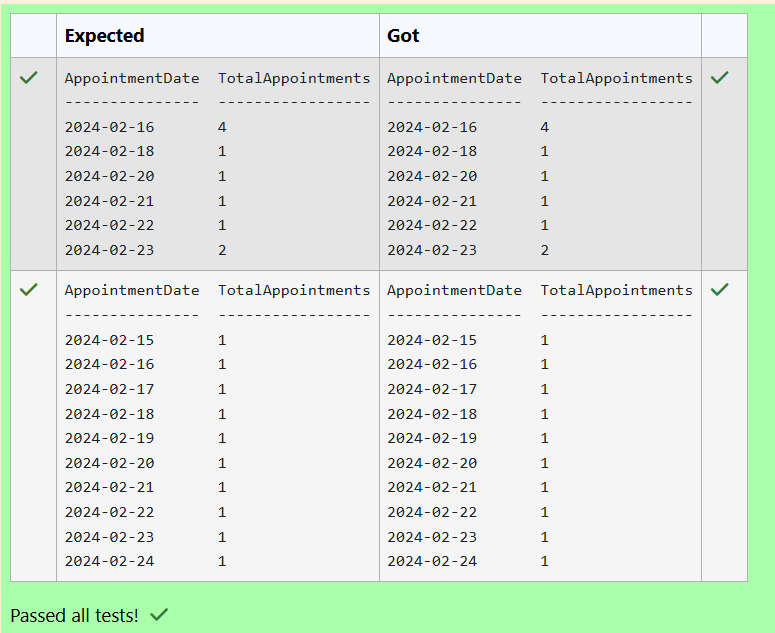
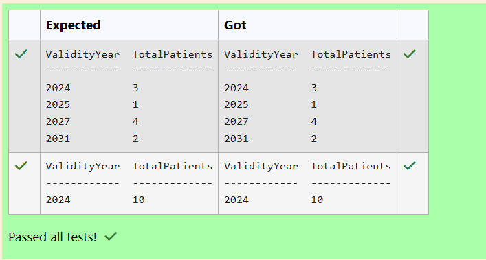
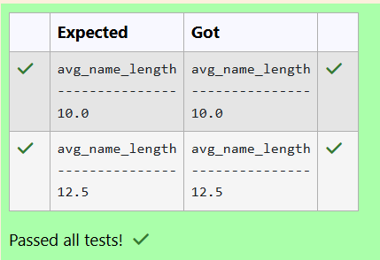
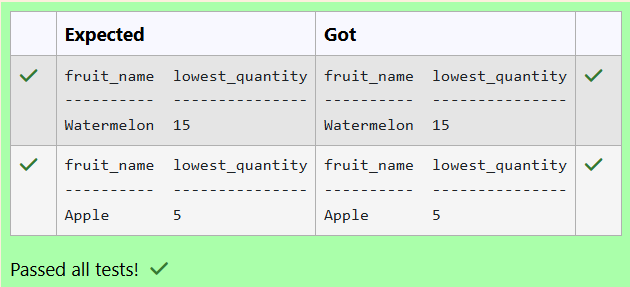
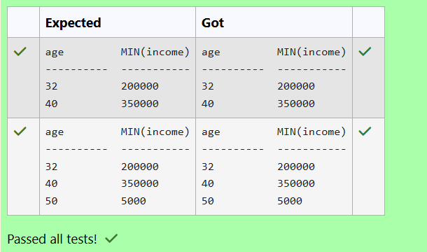
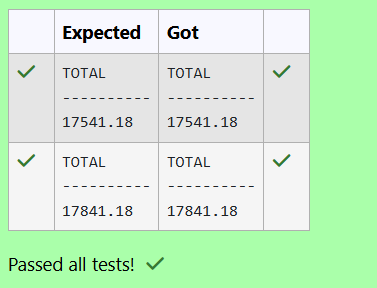
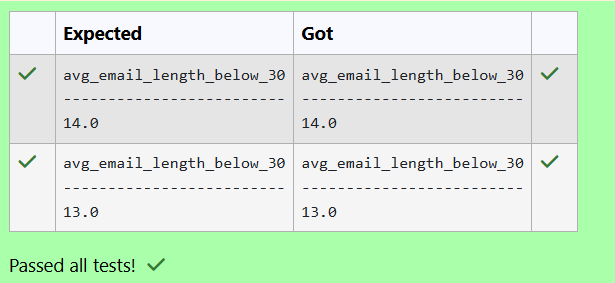

# Experiment 4: Aggregate Functions, Group By and Having Clause

## AIM
To study and implement aggregate functions, GROUP BY, and HAVING clause with suitable examples.

## THEORY

### Aggregate Functions
These perform calculations on a set of values and return a single value.

- **MIN()** – Smallest value  
- **MAX()** – Largest value  
- **COUNT()** – Number of rows  
- **SUM()** – Total of values  
- **AVG()** – Average of values

**Syntax:**
```sql
SELECT AGG_FUNC(column_name) FROM table_name WHERE condition;
```
### GROUP BY
Groups records with the same values in specified columns.
**Syntax:**
```sql
SELECT column_name, AGG_FUNC(column_name)
FROM table_name
GROUP BY column_name;
```
### HAVING
Filters the grouped records based on aggregate conditions.
**Syntax:**
```sql
SELECT column_name, AGG_FUNC(column_name)
FROM table_name
GROUP BY column_name
HAVING condition;
```

**Question 1**
---
What is the total number of appointments scheduled for each day?

Table: __Appointments__
<pre>
name                 type
-------------------  ----------
AppointmentID        INTEGER
PatientID            INTEGER
DoctorID             INTEGER
AppointmentDateTime  DATETIME
Purpose              TEXT
Status               TEXT
</pre>
#### Query
```sql
SELECT DATE(AppointmentDateTime) AS AppointmentDate, COUNT(*) AS TotalAppointments 
FROM Appointments
GROUP BY
DATE(AppointmentDateTime)
ORDER BY AppointmentDate;
```

**Output:**



**Question 2**
---
How many patients have insurance coverage valid in each year?

Sample table:__Insurance Table__
<pre>
name               type
-----------------  ----------
InsuranceID        INTEGER
PatientID          INTEGER
InsuranceCompany   TEXT
PolicyNumber       TEXT
PolicyHolder       TEXT
ValidityPeriod     TEXT
</pre>
#### Query
```sql
SELECT CAST(ValidityPeriod AS INTEGER) AS ValidityYear,
COUNT(DISTINCT PatientID) AS TotalPatients
FROM Insurance
GROUP BY ValidityYear
ORDER BY ValidityYear;
```

**Output:**



**Question 3**
---
Write a SQL query to find the average length of names for people living in Chennai?

Table: __customer__
<pre>
name        type
----------  ----------
id          INTEGER
name        TEXT   
city        TEXT
email       TEXT
phone       INTEGER
</pre>
#### Query
```sql
SELECT AVG(length(name)) AS avg_name_length FROM customer where city='Chennai';
```

**Output:**



**Question 4**
---
Write a SQL query to  find the average salary of all employees?

Table: __employee__
<pre>
name        type
----------  ----------
id          INTEGER
name        TEXT
age         INTEGER
city        TEXT
income      INTEGER
</pre>
#### Query
```sql
SELECT AVG(income) AS Average_Salary FROM employee;
```

**Output:**


**Question 5**
---
Write a SQL query to find the minimum purchase amount.

Sample table: __orders__
<pre>
ord_no      purch_amt   ord_date    customer_id  salesman_id

----------  ----------  ----------  -----------  -----------

70001       150.5       2012-10-05  3005         5002

70009       270.65      2012-09-10  3001         5005

70002       65.26       2012-10-05  3002         5001
</pre>
#### Query
```sql
SELECT MIN(purch_amt) as MINIMUM FROM orders;
```

**Output:**


**Question 6**
---
Write a SQL query to find the Fruit with the lowest available quantity.

Note: Inventory attribute contains amount of fruits

Table: __fruits__
<pre>
name        type
----------  ----------
id          INTEGER
name        TEXT
unit        TEXT
inventory   INTEGER
price       REAL
</pre>
#### Query
```sql
SELECT name AS fruit_name,
inventory AS lowest_quantity
FROM fruits
ORDER BY inventory ASC LIMIT 1;
```

**Output:**



**Question 7**
---
Write the SQL query that accomplishes the grouping of data by joining date (jdate), calculates the minimum work hours for each date, and excludes dates where the minimum work hour is not less than 10.

Sample table: __employee1__

#### Query
```sql
SELECT jdate ,MIN(workhour) FROM employee1 GROUP BY jdate HAVING MIN(workhour)<10;
```

**Output:**


**Question 8**
---
Write the SQL query that achieves the grouping of data by age, calculates the minimum income for each age group, and includes only those age groups where the minimum income is less than 400,000.

Sample table: __employee__

#### Query
```sql
SELECT age,MIN(income) FROM employee GROUP BY age HAVING MIN(income)<400000;
```

**Output:**



**Question 9**
---
Write a SQL query to calculate total purchase amount of all orders. Return total purchase amount.

Sample table: __orders__
<pre>
ord_no      purch_amt   ord_date    customer_id  salesman_id

----------  ----------  ----------  -----------  -----------

70001       150.5       2012-10-05     3005         5002

70009       270.65      2012-09-10     3001         5005

70002       65.26       2012-10-05     3002         5001
</pre>
#### Query
```sql
SELECT SUM(purch_amt) AS TOTAL
FROM orders;
```

**Output:**



**Question 10**
---
Write a SQL query to Calculate the average email length (in characters) for people who lives in Mumbai city

Table: __customer__
<pre>
name        type
----------  ----------
id          INTEGER
name        TEXT   
city        TEXT
email       TEXT
phone       INTEGER
</pre>
#### Query
```sql
SELECT
    AVG(LENGTH(email)) AS
avg_email_length_below_30
FROM
    customer
WHERE
    city='Mumbai';
```

**Output:**



## RESULT
Thus, the SQL queries to implement aggregate functions, GROUP BY, and HAVING clause have been executed successfully.
