# Experiment 5: Subqueries and Views

## AIM
To study and implement subqueries and views.

## THEORY

### Subqueries
A subquery is a query inside another SQL query and is embedded in:
- WHERE clause
- HAVING clause
- FROM clause

**Types:**
- **Single-row subquery**:
  Sub queries can also return more than one value. Such results should be made use along with the operators in and any.
- **Multiple-row subquery**:
  Here more than one subquery is used. These multiple sub queries are combined by means of ‘and’ & ‘or’ keywords.
- **Correlated subquery**:
  A subquery is evaluated once for the entire parent statement whereas a correlated Sub query is evaluated once per row processed by the parent statement.

**Example:**
```sql
SELECT * FROM employees
WHERE salary > (SELECT AVG(salary) FROM employees);
```
### Views
A view is a virtual table based on the result of an SQL SELECT query.
**Create View:**
```sql
CREATE VIEW view_name AS
SELECT column1, column2 FROM table_name WHERE condition;
```
**Drop View:**
```sql
DROP VIEW view_name;
```

**Question 1**
--
Write a SQL query to Find employees who have an age less than the average age of employees with incomes over 1 million

__Employee Table__
<pre>
name             type

------------   ---------------

id                INTEGER

name              TEXT

age               INTEGER

city              TEXT

income            INTEGER
</pre>
#### Query
```sql
SELECT *
FROM Employee
WHERE age < (
    SELECT AVG(age)
    FROM Employee
    WHERE income > 1000000
);
```

**Output:**

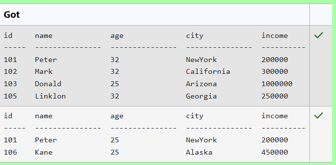

**Question 2**
---
Write a query to display all the customers whose ID is the difference between the salesperson ID of Mc Lyon and 2001.

__salesman table__
<pre>
name             type
---------------  ---------------
salesman_id      numeric(5)
name             varchar(30)
city             varchar(15)
commission       decimal(5,2)
</pre>
__customer table__
<pre>
name         type
-----------  ----------
customer_id  int
cust_name    text
city         text
grade        int
salesman_id  int
</pre>
#### Query
```sql
SELECT *
FROM customer
WHERE customer_id = (
    SELECT salesman_id - 2001
    FROM salesman
    WHERE name = 'Mc Lyon'
);
```

**Output:**

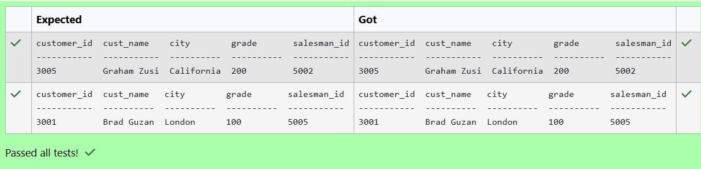

**Question 3**
---
Write a SQL query to Retrieve the medications with dosages equal to the lowest dosage

Table Name: __Medications (attributes: medication_id, medication_name, dosage)__
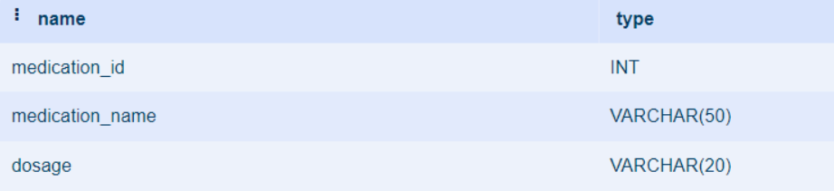
#### Query
```sql
SELECT *
FROM Medications
WHERE CAST(REPLACE(dosage, 'mg', '') AS INT) = (
    SELECT MIN(CAST(REPLACE(dosage, 'mg', '') AS INT))
    FROM Medications
);
```

**Output:**

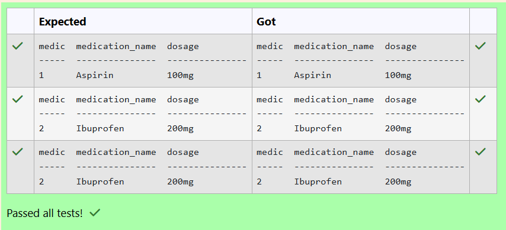

**Question 4**
---
Write a SQL query to retrieve all columns from the CUSTOMERS table for customers whose salary is EQUAL TO $1500.

Sample table: __CUSTOMERS__
<pre>
ID          NAME        AGE         ADDRESS     SALARY
----------  ----------  ----------  ----------  ----------

1          Ramesh        32          Ahmedabad     2000
2          Khilan        25          Delhi         1500
3          Kaushik       23          Kota          2000
4          Chaitali      25          Mumbai        6500
5          Hardik        27          Bhopal        8500
6          Komal         22          Hyderabad     4500
7          Muffy         24          Indore        10000
</pre>
#### Query
```sql
SELECT * FROM CUSTOMERS WHERE SALARY = 1500;
```

**Output:**


**Question 5**
---
Write a SQL query that retrieves the names of students and their corresponding grades, where the grade is equal to the maximum grade achieved in each subject.

Sample table: __GRADES (attributes: student_id, student_name, subject, grade)__
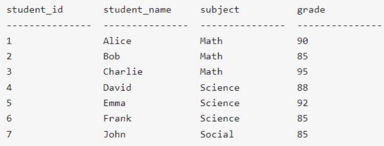
#### Query
```sql
SELECT student_name, grade
FROM GRADES g
WHERE grade = (
    SELECT MAX(grade)
    FROM GRADES
    WHERE subject = g.subject
);
```

**Output:**

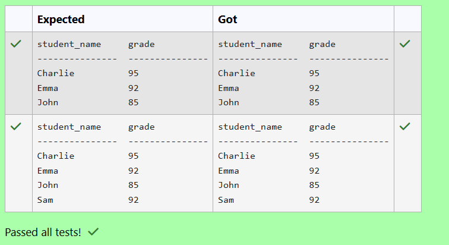

**Question 6**
---
From the following tables, write a SQL query to find all orders generated by the salespeople who may work for customers whose id is 3007. Return ord_no, purch_amt, ord_date, customer_id, salesman_id.

Table Name: __orders__
<pre>
name             type
---------------  --------
order_no         int
purch_amt        real
order_date       text
customer_id      int
salesman_id      int
</pre>
#### Query
```sql
SELECT ord_no, purch_amt, ord_date, customer_id, salesman_id
FROM orders
WHERE salesman_id IN (
    SELECT salesman_id
    FROM orders
    WHERE customer_id = 3007
);
```

**Output:**

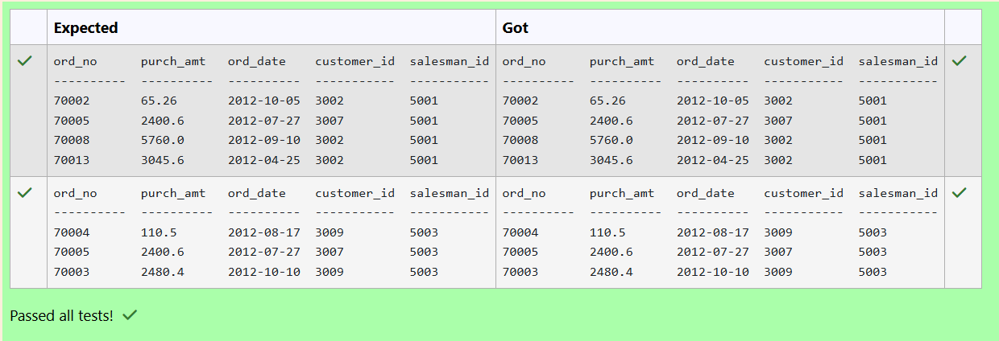

**Question 7**
---
Write a SQL query to Identify customers whose city is different from the city of the customer with the highest ID

SAMPLE TABLE: __customer__
<pre>
name             type
---------------  ---------------
id               INTEGER
name             TEXT
city             TEXT
email            TEXT
phone            INTEGER
</pre>
#### Query
```sql
SELECT *
FROM customer
WHERE city <> (
    SELECT city
    FROM customer
    WHERE id = (SELECT MAX(id) FROM customer)
);
```

**Output:**

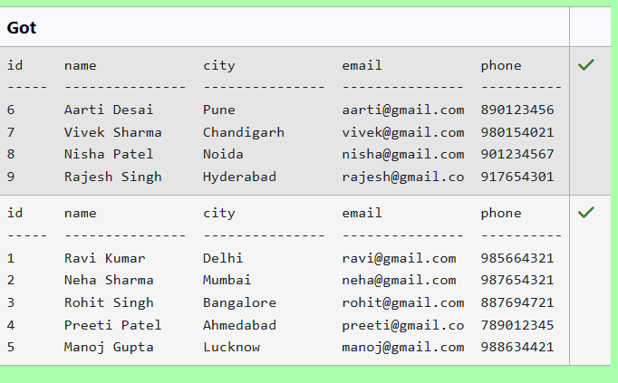

**Question 8**
---
From the following tables write a SQL query to find the order values greater than the average order value of 10th October 2012. Return ord_no, purch_amt, ord_date, customer_id, salesman_id.

Note: date should be yyyy-mm-dd format

__ORDERS TABLE__
<pre>
name            type
----------     ----------
ord_no          int
purch_amt       real
ord_date        text
customer_id     int
salesman_id     int

</pre>
#### Query
```sql
SELECT ord_no, purch_amt, ord_date, customer_id, salesman_id
FROM orders
WHERE purch_amt > (
    SELECT AVG(purch_amt)
    FROM orders
    WHERE ord_date = '2012-10-10'
);
```

**Output:**

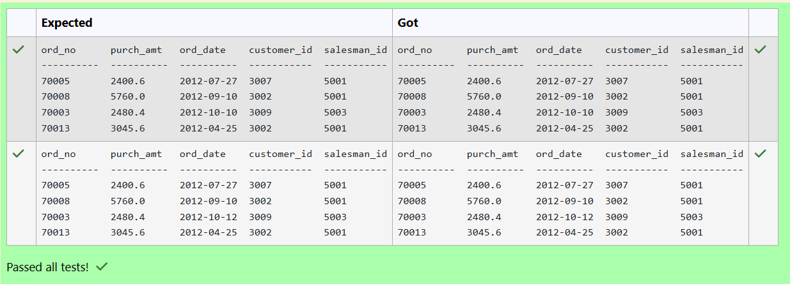

**Question 9**
---
Write a SQL query to retrieve all columns from the CUSTOMERS table for customers whose Address as Delhi and age below 30

Sample table: __CUSTOMERS__
<pre>
ID          NAME        AGE         ADDRESS     SALARY
----------  ----------  ----------  ----------  ----------

1          Ramesh        32         Ahmedabad     2000
2          Khilan        25         Delhi         1500
3          Kaushik       23         Kota          2000
4          Chaitali      25         Mumbai        6500
5          Hardik        27         Bhopal        8500
6          Komal         22         Hyderabad     4500
7          Muffy         24         Indore        10000
</pre>
#### Query
```sql
SELECT * 
FROM CUSTOMERS
WHERE ADDRESS = 'Delhi' AND age <=30 ORDER BY (ID);
```

**Output:**

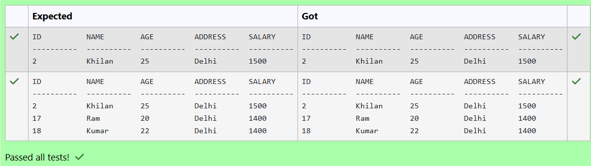

**Question 10**
---
Write a SQL query to Retrieve the names and cities of customers who have the same city as customers with IDs 3 and 7

SAMPLE TABLE: __customer__
<pre>
name             type
---------------  ---------------
id               INTEGER
name             TEXT
city             TEXT
email            TEXT
phone            INTEGER
</pre>
#### Query
```sql
SELECT name, city
FROM customer
WHERE city IN (
    SELECT city
    FROM customer
    WHERE id IN (3, 7)
);
```

**Output:**

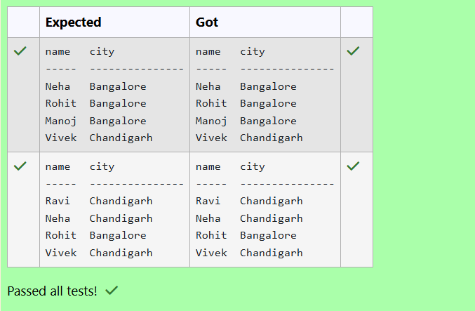

## RESULT
Thus, the SQL queries to implement subqueries and views have been executed successfully.
