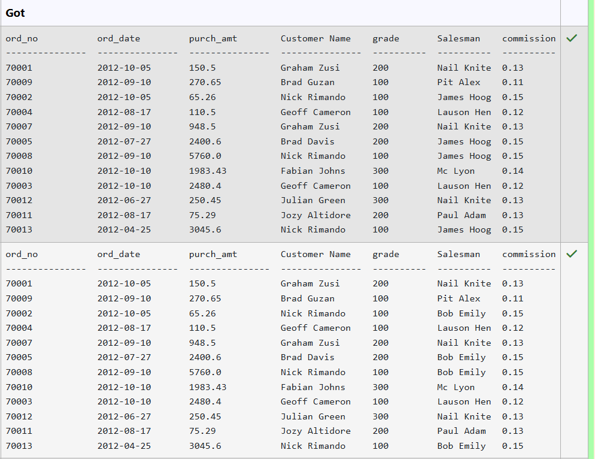
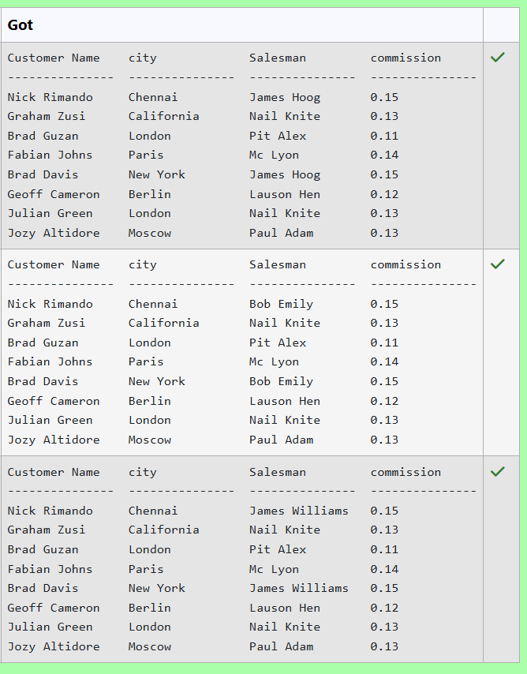
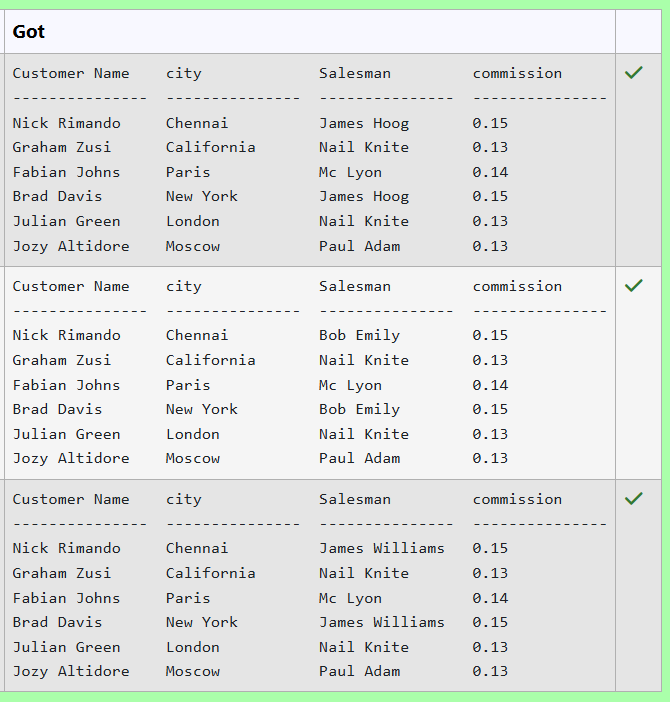
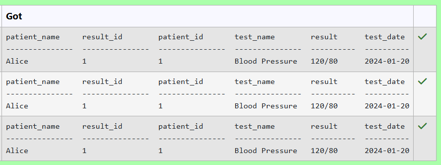
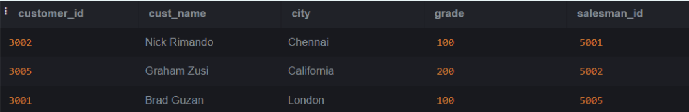
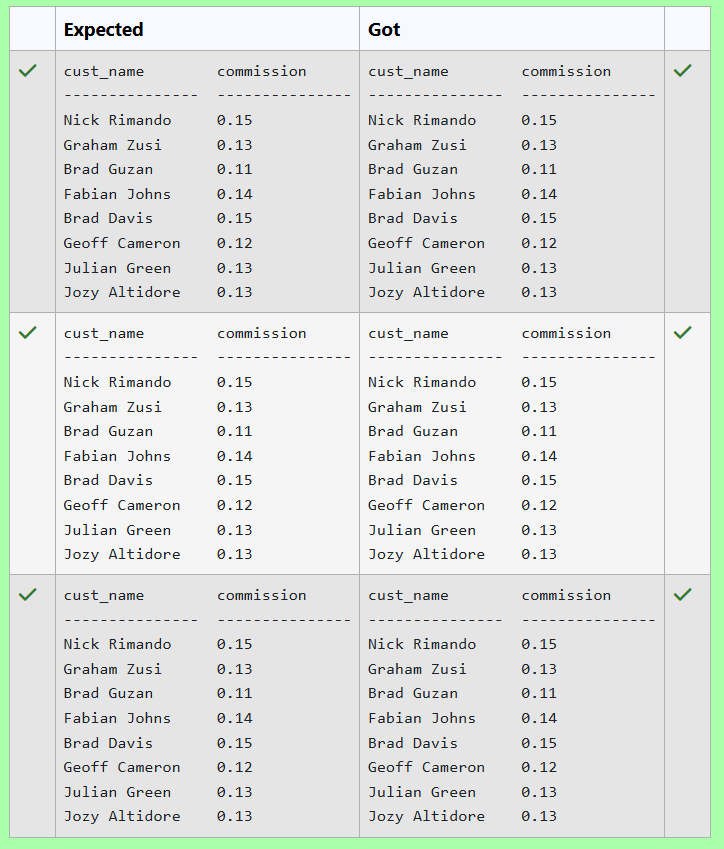
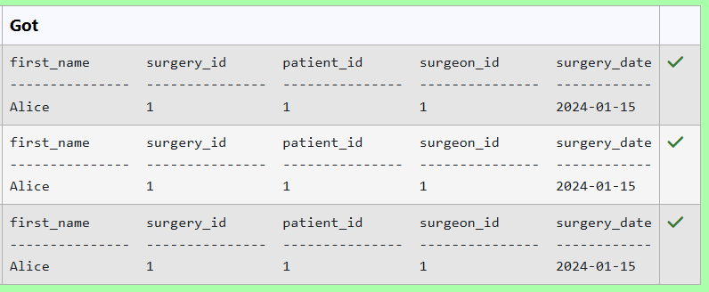
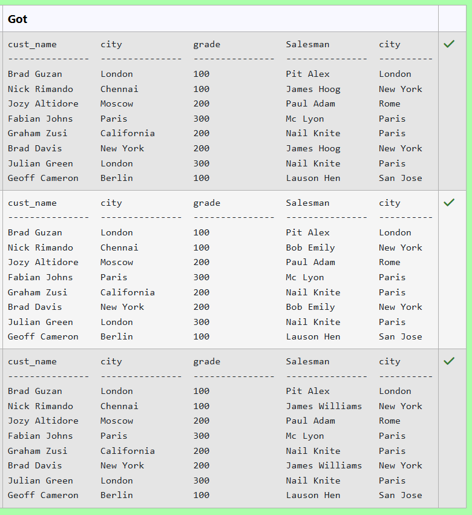
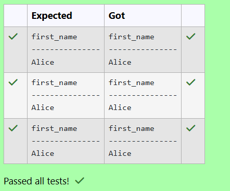
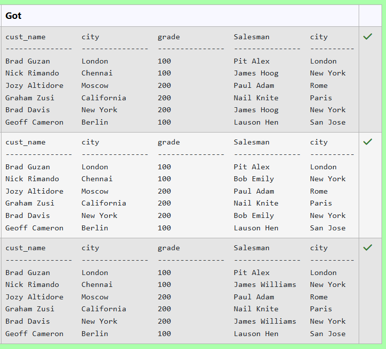

# Experiment 6: Joins

## AIM
To study and implement different types of joins.

## THEORY

SQL Joins are used to combine records from two or more tables based on a related column.

### 1. INNER JOIN
Returns records with matching values in both tables.

**Syntax:**
```sql
SELECT columns
FROM table1
INNER JOIN table2
ON table1.column = table2.column;
```

### 2. LEFT JOIN
Returns all records from the left table, and matched records from the right.

**Syntax:**

```sql
SELECT columns
FROM table1
LEFT JOIN table2
ON table1.column = table2.column;
```
### 3. RIGHT JOIN
Returns all records from the right table, and matched records from the left.

**Syntax:**

```sql
SELECT columns
FROM table1
RIGHT JOIN table2
ON table1.column = table2.column;
```
### 4. FULL OUTER JOIN
Returns all records when there is a match in either left or right table.

**Syntax:**

```sql
SELECT columns
FROM table1
FULL OUTER JOIN table2
ON table1.column = table2.column;
```

**Question 1**
--
From the following tables write a SQL query to find the details of an order. Return ord_no, ord_date, purch_amt, Customer Name, grade, Salesman, commission. 

Sample table: __orders__
<pre>
ord_no      purch_amt   ord_date    customer_id  salesman_id
----------  ----------  ----------  -----------  -----------
70001       150.5       2012-10-05  3005         5002
70009       270.65      2012-09-10  3001         5005
70002       65.26       2012-10-05  3002         5001
70004       110.5       2012-08-17  3009         5003
70007       948.5       2012-09-10  3005         5002
70005       2400.6      2012-07-27  3007         5001
70008       5760        2012-09-10  3002         5001
70010       1983.43     2012-10-10  3004         5006
70003       2480.4      2012-10-10  3009         5003
70012       250.45      2012-06-27  3008         5002
70011       75.29       2012-08-17  3003         5007
70013       3045.6      2012-04-25  3002         5001
</pre>
Sample table: __customer__
<pre>
 customer_id |   cust_name    |    city    | grade | salesman_id 
-------------+----------------+------------+-------+-------------
        3002 | Nick Rimando   | New York   |   100 |        5001
        3007 | Brad Davis     | New York   |   200 |        5001
        3005 | Graham Zusi    | California |   200 |        5002
        3008 | Julian Green   | London     |   300 |        5002
        3004 | Fabian Johnson | Paris      |   300 |        5006
        3009 | Geoff Cameron  | Berlin     |   100 |        5003
        3003 | Jozy Altidor   | Moscow     |   200 |        5007
        3001 | Brad Guzan     | London     |       |        5005
</pre>
Sample table: __salesman__
<pre>
 salesman_id |    name    |   city   | commission 
-------------+------------+----------+------------
        5001 | James Hoog | New York |       0.15
        5002 | Nail Knite | Paris    |       0.13
        5005 | Pit Alex   | London   |       0.11
        5006 | Mc Lyon    | Paris    |       0.14
        5007 | Paul Adam  | Rome     |       0.13
</pre>
#### Query
```sql
SELECT 
    o.ord_no,
    o.ord_date,
    o.purch_amt,
    c.cust_name AS "Customer Name",
    c.grade,
    s.name AS "Salesman",
    s.commission
FROM 
    orders o
JOIN 
    customer c ON o.customer_id = c.customer_id
JOIN 
    salesman s ON o.salesman_id = s.salesman_id;
```

**Output:**



**Question 2**
---
From the following tables write a SQL query to find those orders where the order amount exists between 500 and 2000. Return ord_no, purch_amt, cust_name, city.

Sample table: __customer__
<pre>
 customer_id |   cust_name    |    city    | grade | salesman_id 
-------------+----------------+------------+-------+-------------
        3002 | Nick Rimando   | New York   |   100 |        5001
        3007 | Brad Davis     | New York   |   200 |        5001
        3005 | Graham Zusi    | California |   200 |        5002
        3008 | Julian Green   | London     |   300 |        5002
        3004 | Fabian Johnson | Paris      |   300 |        5006
        3009 | Geoff Cameron  | Berlin     |   100 |        5003
        3003 | Jozy Altidor   | Moscow     |   200 |        5007
        3001 | Brad Guzan     | London     |       |        5005
</pre>
Sample table: __orders__
<pre>
ord_no      purch_amt   ord_date    customer_id  salesman_id
----------  ----------  ----------  -----------  -----------
70001       150.5       2012-10-05  3005         5002
70009       270.65      2012-09-10  3001         5005
70002       65.26       2012-10-05  3002         5001
70004       110.5       2012-08-17  3009         5003
70007       948.5       2012-09-10  3005         5002
70005       2400.6      2012-07-27  3007         5001
70008       5760        2012-09-10  3002         5001
70010       1983.43     2012-10-10  3004         5006
70003       2480.4      2012-10-10  3009         5003
70012       250.45      2012-06-27  3008         5002
70011       75.29       2012-08-17  3003         5007
70013       3045.6      2012-04-25  3002         5001
</pre>
#### Query
```sql
SELECT 
    o.ord_no,
    o.purch_amt,
    c.cust_name,
    c.city
FROM 
    orders o
JOIN 
    customer c ON o.customer_id = c.customer_id
WHERE 
    o.purch_amt BETWEEN 500 AND 2000;
```

**Output:**


**Question 3**
---
From the following tables write a SQL query to find the salesperson(s) and the customer(s) he represents. Return Customer Name, city, Salesman, commission.

Sample table: __customer__
<pre>
 customer_id |   cust_name    |    city    | grade | salesman_id 
-------------+----------------+------------+-------+-------------
        3002 | Nick Rimando   | New York   |   100 |        5001
        3007 | Brad Davis     | New York   |   200 |        5001
        3005 | Graham Zusi    | California |   200 |        5002
        3008 | Julian Green   | London     |   300 |        5002
        3004 | Fabian Johnson | Paris      |   300 |        5006
        3009 | Geoff Cameron  | Berlin     |   100 |        5003
        3003 | Jozy Altidor   | Moscow     |   200 |        5007
        3001 | Brad Guzan     | London     |       |        5005
</pre>
Sample table: __salesman__
<pre>
 salesman_id |    name    |   city   | commission 
-------------+------------+----------+------------
        5001 | James Hoog | New York |       0.15
        5002 | Nail Knite | Paris    |       0.13
        5005 | Pit Alex   | London   |       0.11
        5006 | Mc Lyon    | Paris    |       0.14
        5007 | Paul Adam  | Rome     |       0.13
        5003 | Lauson Hen | San Jose |       0.12
</pre>
#### Query
```sql
SELECT 
    c.cust_name AS "Customer Name",
    c.city,
    s.name AS "Salesman",
    s.commission
FROM 
    customer c
JOIN 
    salesman s ON c.salesman_id = s.salesman_id;
```

**Output:**



**Question 4**
---
 From the following tables write a SQL query to find salespeople who received commissions of more than 12 percent from the company. Return Customer Name, customer city, Salesman, commission.  

Sample table: __customer__
<pre>
 customer_id |   cust_name    |    city    | grade | salesman_id 
-------------+----------------+------------+-------+-------------
        3002 | Nick Rimando   | New York   |   100 |        5001
        3007 | Brad Davis     | New York   |   200 |        5001
        3005 | Graham Zusi    | California |   200 |        5002
        3008 | Julian Green   | London     |   300 |        5002
        3004 | Fabian Johnson | Paris      |   300 |        5006
        3009 | Geoff Cameron  | Berlin     |   100 |        5003
        3003 | Jozy Altidor   | Moscow     |   200 |        5007
        3001 | Brad Guzan     | London     |       |        5005
</pre>
Sample table: __salesman__
<pre>
 salesman_id |    name    |   city   | commission 
-------------+------------+----------+------------
        5001 | James Hoog | New York |       0.15
        5002 | Nail Knite | Paris    |       0.13
        5005 | Pit Alex   | London   |       0.11
        5006 | Mc Lyon    | Paris    |       0.14
        5007 | Paul Adam  | Rome     |       0.13
        5003 | Lauson Hen | San Jose |       0.12
</pre>
#### Query
```sql
SELECT 
    c.cust_name AS "Customer Name",
    c.city,
    s.name AS "Salesman",
    s.commission
FROM 
    customer c
JOIN 
    salesman s ON c.salesman_id = s.salesman_id
WHERE 
    s.commission > 0.12;
```

**Output:**



**Question 5**
---
Write the SQL query that achieves the selection of the first name from the "patients" table (aliased as "patient_name") and all columns from the "test_results" table (aliased as "t"), with an inner join on the "patient_id" column and a condition filtering for test results with the test name 'Blood Pressure'.

__PATIENTS TABLE:__

__ATTRIBUTES - patient_id, first_name, last_name, date_of_birth, admission_date, discharge_date, doctor_id__


__TEST_RESULT TABLES:__

__ATTRIBUTES - result_id, patient_id, test_name, result, test_date__


#### Query
```sql
SELECT 
    p.first_name AS patient_name,
    t.result_id,
    t.patient_id,
    t.test_name,
    t.result,
    t.test_date
FROM 
    patients p
INNER JOIN 
    test_results t ON p.patient_id = t.patient_id
WHERE 
    t.test_name = 'Blood Pressure';
```

**Output:**



**Question 6**
---
Write the SQL query that achieves the selection of the "cust_name" column from the "customer" table (aliased as "c") and the "commission" column from the "salesman" table (aliased as "s"), with a left join on the "salesman_id" column.

__Customer Table__:


__Salesmen Table__:

#### Query
```sql
SELECT 
    c.cust_name,
    s.commission
FROM 
    customer c
LEFT JOIN 
    salesman s ON c.salesman_id = s.salesman_id;

```

**Output:**



**Question 7**
---
Write the SQL query that accomplishes the selection of the first name from the "patients" table and all columns from the "surgeries" table, with an inner join on the "patient_id" column and a condition filtering for patients with the first name 'Alice'.

__PATIENTS TABLE__:
<pre>
name             type
---------------  ---------------
patient_id       INT
first_name       VARCHAR(50)
last_name        VARCHAR(50)
date_of_birth    DATE
admission_date   DATE
discharge_date   DATE
doctor_id        INT
</pre>
__SURGERIES TABLE__:
<pre>
name             type
---------------  ---------------
surgery_id       INT
patient_id       INT
surgeon_id       INT
surgery_date     DATE
</pre>
#### Query
```sql
SELECT patients.first_name, surgeries.*
FROM patients
INNER JOIN surgeries ON patients.patient_id = surgeries.patient_id
WHERE patients.first_name = 'Alice';
```

**Output:**



**Question 8**
---
From the following tables write a SQL query to display the customer name, customer city, grade, salesman, salesman city. The results should be sorted by ascending customer_id.  

Sample table: __customer__
<pre>
 customer_id |   cust_name    |    city    | grade | salesman_id 
-------------+----------------+------------+-------+-------------
        3002 | Nick Rimando   | New York   |   100 |        5001
        3007 | Brad Davis     | New York   |   200 |        5001
        3005 | Graham Zusi    | California |   200 |        5002
        3008 | Julian Green   | London     |   300 |        5002
        3004 | Fabian Johnson | Paris      |   300 |        5006
        3009 | Geoff Cameron  | Berlin     |   100 |        5003
        3003 | Jozy Altidor   | Moscow     |   200 |        5007
        3001 | Brad Guzan     | London     |       |        5005
</pre>
Sample table: __salesman__
<pre>
 salesman_id |    name    |   city   | commission 
-------------+------------+----------+------------
        5001 | James Hoog | New York |       0.15
        5002 | Nail Knite | Paris    |       0.13
        5005 | Pit Alex   | London   |       0.11
        5006 | Mc Lyon    | Paris    |       0.14
        5007 | Paul Adam  | Rome     |       0.13
        5003 | Lauson Hen | San Jose |       0.12
</pre>
#### Query

```sql
SELECT 
    c.cust_name AS cust_name, 
    c.city AS city, 
    c.grade, 
    s.name AS Salesman, 
    s.city AS city
FROM 
    customer c
JOIN 
    salesman s 
ON 
    c.salesman_id = s.salesman_id
ORDER BY 
    c.customer_id ASC;
```

**Output:**



**Question 9**
---
Write the SQL query that achieves the selection of the first name from the "patients" table, with an inner join on the "patient_id" column and a condition filtering for surgeries with a surgery date of '2024-01-15'.:

__PATIENTS TABLE__:
<pre>
name             type
---------------  ---------------
patient_id       INT
first_name       VARCHAR(50)
last_name        VARCHAR(50)
date_of_birth    DATE
admission_date   DATE
discharge_date   DATE
doctor_id        INT
</pre>
__SURGERIES TABLE__:
<pre>
name             type
---------------  ---------------
surgery_id       INT
patient_id       INT
surgeon_id       INT
surgery_date     DATE
</pre>
#### Query
```sql
SELECT 
    p.first_name
FROM 
    patients p
INNER JOIN 
    surgeries s 
ON 
    p.patient_id = s.patient_id
WHERE 
    s.surgery_date = '2024-01-15';
```

**Output:**



**Question 10**
---
From the following tables write a SQL query to find those customers with a grade less than 300. Return cust_name, customer city, grade, Salesman, salesmancity. The result should be ordered by ascending customer_id. 

Sample table: __customer__
<pre>
 customer_id |   cust_name    |    city    | grade | salesman_id 
-------------+----------------+------------+-------+-------------
        3002 | Nick Rimando   | New York   |   100 |        5001
        3007 | Brad Davis     | New York   |   200 |        5001
        3005 | Graham Zusi    | California |   200 |        5002
        3008 | Julian Green   | London     |   300 |        5002
        3004 | Fabian Johnson | Paris      |   300 |        5006
        3009 | Geoff Cameron  | Berlin     |   100 |        5003
        3003 | Jozy Altidor   | Moscow     |   200 |        5007
        3001 | Brad Guzan     | London     |       |        5005
</pre>
Sample table: __salesman__
<pre>
 salesman_id |    name    |   city   | commission 
-------------+------------+----------+------------
        5001 | James Hoog | New York |       0.15
        5002 | Nail Knite | Paris    |       0.13
        5005 | Pit Alex   | London   |       0.11
        5006 | Mc Lyon    | Paris    |       0.14
        5007 | Paul Adam  | Rome     |       0.13
        5003 | Lauson Hen | San Jose |       0.12
</pre>
#### Query
```sql
SELECT 
    c.cust_name, 
    c.city, 
    c.grade, 
    s.name AS Salesman, 
    s.city AS city
FROM 
    customer c
INNER JOIN 
    salesman s
ON 
    c.salesman_id = s.salesman_id
WHERE 
    c.grade < 300
ORDER BY 
    c.customer_id ASC;
```

**Output:**



## RESULT
Thus, the SQL queries to implement different types of joins have been executed successfully.
